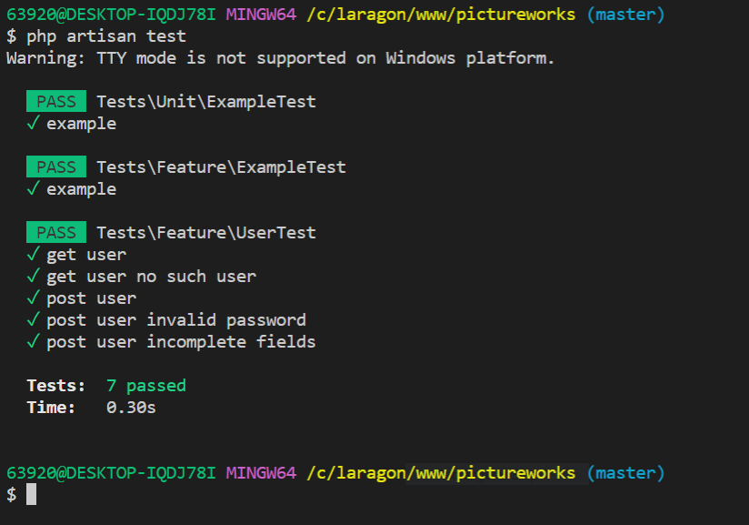
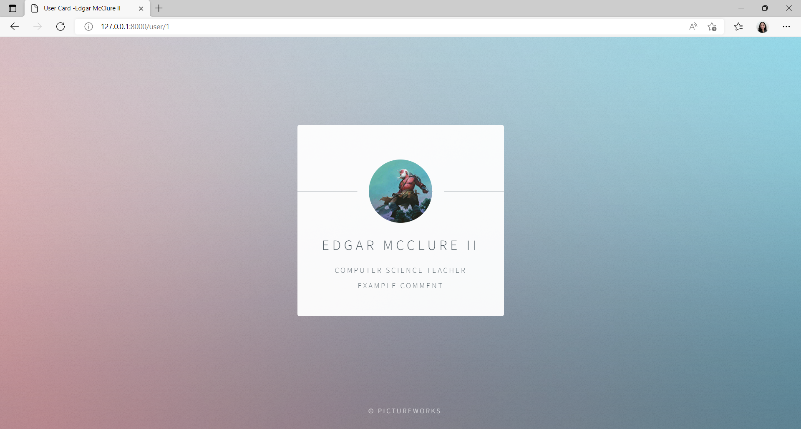
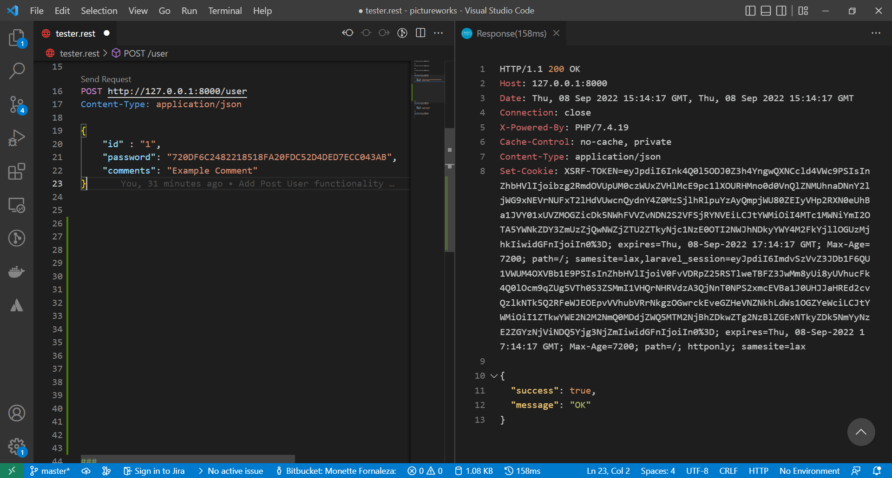

## Getting Started

### Install from repository

Clone the repository:

    git clone https://github.com/monettayy/pictureworks.git

Navigate to the directory and run:

    composer install

Copy the example .env file:

    cp .env.example .env

Generate an application key:

    php artisan key:generate

View the website:

    php artisan serve
    
### Setup Database

Create your Database,
Go to the .env File and put your database credentials
    
    DB_DATABASE=your-database-here
    DB_USERNAME=root
    DB_PASSWORD=
    

In your terminal run:
    
    php artisan migrate
    php artisan db:seed

### Routes

Get User

    GET     http://127.0.0.1:8000/user/{id}
            params: 
                * id - unique identifier / pk 
            - displays the image, name and comments for fetched user

Post User

    POST    http://127.0.0.1:8000/user
            params: 
                * id
                * comments
                * password
            - updates the user's comments by appending the given comments

### Artisan Commands

    php artisan post:user {id} {comments} {password}
            params: 
                * id
                * comments
                * password

## Testing

Unit Test

    php artisan test

Get User

Post User

